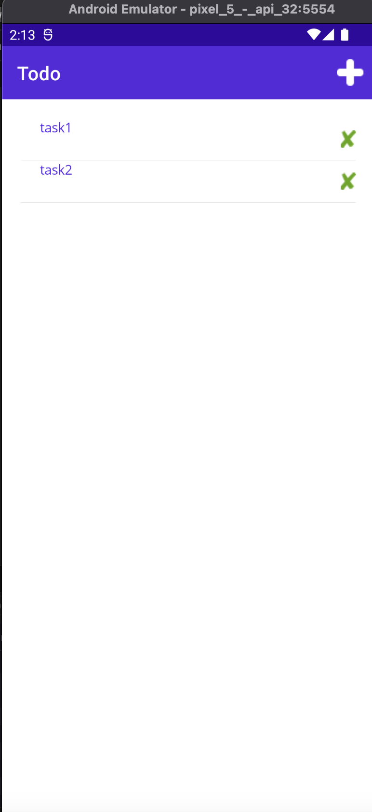
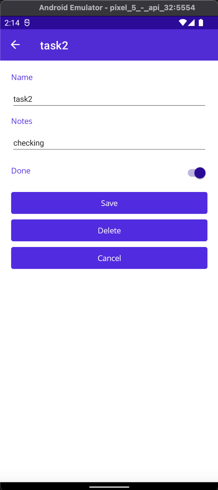
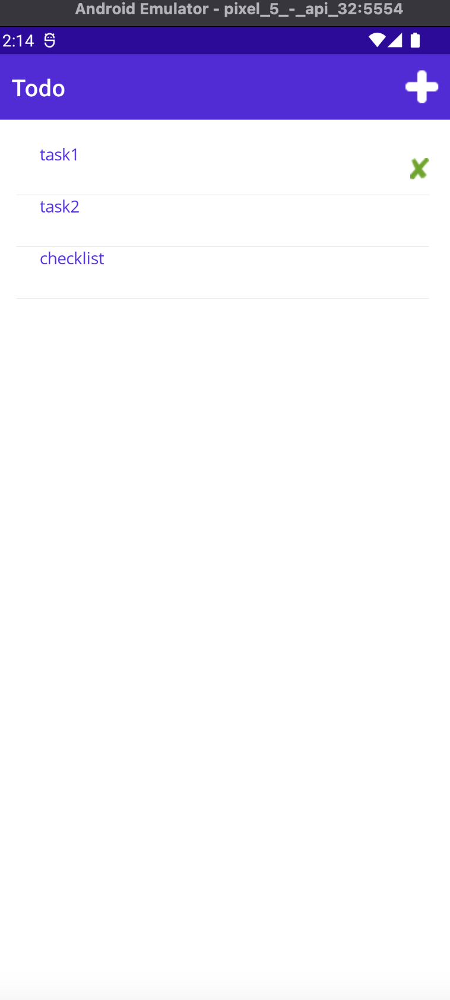
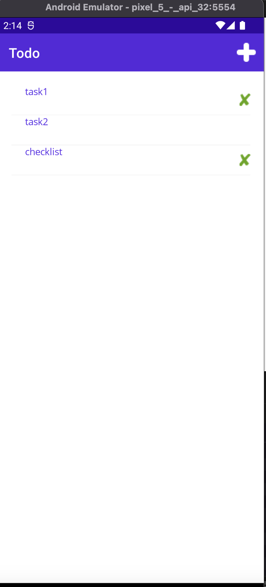

# Todo App

# ToDO App
----
### Team Members: 
- SureshhKumarVeerapathiran
- kilaruPrathyusha
- patibandla pavan

----
### Teammate's Contribution:  

#### suresh
 
  
      
   ##### Final Project:
  1. Backend Logic( cs files)
  2. About UI changes
  3. Documentation
  
#### kilaruPrathyusha
 

     ##### Final Project:
1. Frontend Logic for app
2. DB connection(sqlite3)
3. backend logic( creation and update)

#### patibandla pavan

    ##### Final Project:
  1. layout for todo creation form
  2. services addition and module separation 
  3. UI changes in colors and style in resources
  4. deletion logic in cs files(deletion)

----
### Images:  
 
 

  #### Final Project: 

